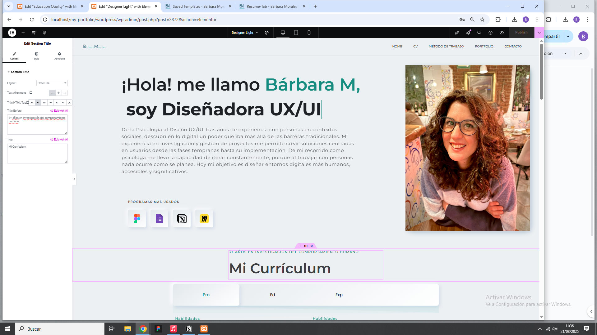
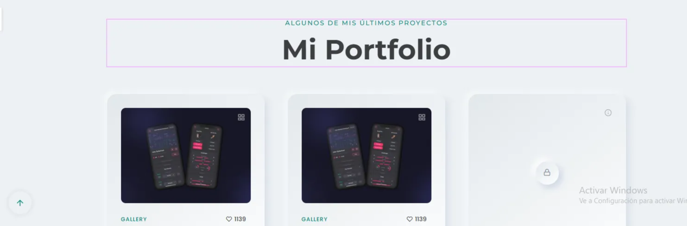
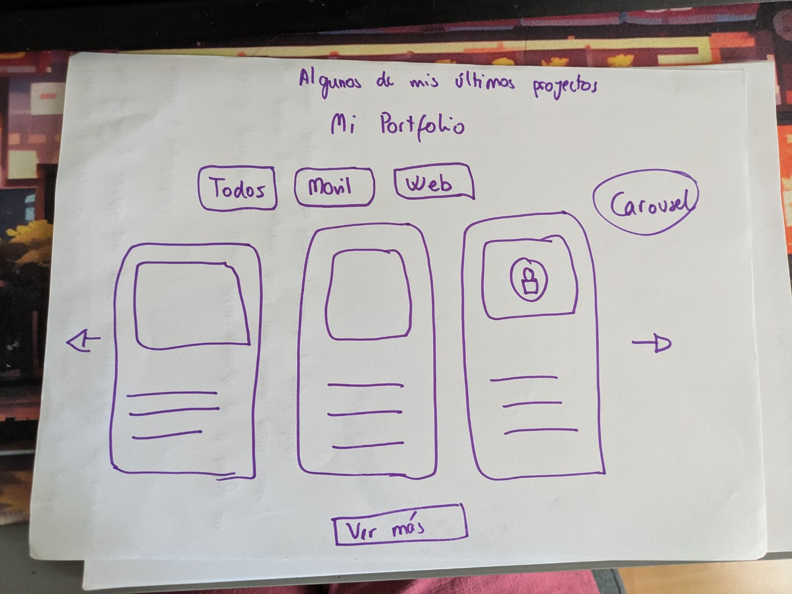

# Portfolio

# 1. Brand identity

- Tipografía:
    - Montserrat
- Colores:
    - Primario: #158c7f
    - Secundario from: #1fa99a
    - Secundario to:  # 164e63
    - Acento: #158c7f
    - como alternativa c55d7a + 1fa9d6 + 164e63 (rosa)

# 2. Hero section

¡Hola! me llamo Bárbara M, + clip list: Diseñadora UX/UI / Psicóloga + foto

De la Psicología al Diseño UX/UI: tras años de experiencia con personas en contextos sociales, descubrí en lo digital un poder que iba más allá de las barreras tradicionales.

Mi experiencia en investigación y gestión de proyectos me permite crear soluciones centradas en usuarios desde las fases tempranas hasta su implementación. De mi recorrido como psicóloga me llevo la capacidad de iterar constantemente, porque al trabajar con personas nada ocurre como se planea.

Hoy mi objetivo es diseñar entornos digitales más humanos, accesibles y significativos.

Programas más usados: Figma + google forms + notion + miro

## **AÑADIR INDICE PORTOFOLIO**

# 3. Mi currículum:

3+ años en investigación del comportamiento humano + Mi curriculum

## Experiencia laboral

2016 - Actualidad

## A. Experiencia laboral

2022 - Actualidad

- **Coordinadora de proyectos sociales - Federación de Plataformas Sociales Pinardi - 03/2023 - 05/2025**
    - Acompañamiento de más de 100 usuarios mediante herramientas digitales de gestión y análisis de datos, identificando necesidades y adaptando soluciones personalizadas.
    - Investigación de usuarios: mapeo de necesidades y diseño de experiencias de aprendizaje a través de plataformas digitales y recursos e-learning.
    - Registro de casos y gestión de proyectos con sistemas electrónicos de información (I3L, Sira) y plataformas digitales públicas.
    - Diseño y prototipado de cápsulas formativas del entorno digital incluyendo herramientas de IA y aplicando enfoques iterativos para mejorar la experiencia.
    - Colaboración con equipos multidisciplinares y stakeholders mediante CRM y plataformas colaborativas, garantizando comunicación eficiente y coherencia en la gestión de los usuarios.
    - Aplicación de protocolos de seguridad y anonimización de datos, asegurando entornos digitales confiables y centrados en el usuario
- **Project manager - Asociación Guaraní 01/2022 / 02/2023**
    - Identificación de oportunidades de financiación, gestión de proyecto y creación de entregables en fecha.
    - Investigación de mercado y análisis de tendencias mediante herramientas digitales y scraping automatizado, aplicando métodos de user research para comprender necesidades y comportamientos de usuarios.
    - Planificación y coordinación de proyectos colaborativos usando herramientas en la nube y reportes automatizados, optimizando la **experiencia de equipo** y los **flujos de trabajo** en entornos multidisciplinarios.
    - Financiación aprobada por la Unión Europea (KA2) con un presupuesto de 250.000€ llamado “Women Sport Empowerment - WES” con dos años de duración en 5 países europeos.
    
    ## B. Experiencia laboral complementaria
    
    2017 - 2022
    
    - **Psicóloga - Teléfono de la Esperanza - 09/2016 - 07/2017**
        - Atención psicológica inicial por teléfono siguiendo protocolos digitales de intervención y desarrollo habilidades de interacción centrada en el usuario.
        - Coordinación de acciones con equipos de emergencia mediante sistemas de comunicación en tiempo real, reforzando la gestión de flujos de información y colaboración digital.
        - Registro y análisis de casos utilizando herramientas básicas de CRM, asegurando el cumplimiento de la protección de datos, fortaleciendo competencias en documentación y análisis de información del usuario.
        
        **Coordinadora logística de proyectos europeos - Amigos de Europa - 2015 - 2017**
        
        - Coordinación logística de proyectos europeos, gestionando viajes, planificación de eventos y soporte a participantes mediante plataformas digitales (Google Sheets, Rome2Rio, Airbnb for Work), desarrollando habilidades de organización de flujos de usuario y experiencia de servicio.
        - Facilitación de comunicación interna y externa en equipos internacionales usando plataformas colaborativas (Slack, Zoom, Google Drive).
        - Desarrollo de flujos de trabajo centrados en el usuario en entornos multiculturales, priorizando accesibilidad, claridad digital y usabilidad para el equipo en todas las tareas de coordinación.
    - **Sales Assistant/RRHH - Visivel and Invisivel - 2017 / 2022**
    - Trabajo en entorno minorista dinámico, apoyando en la inducción de personal, planificación de turnos y gestión digital de registros mediante software de RRHH y herramientas basadas en Excel, desarrollando habilidades en organización y flujos de trabajo eficientes.
    - Implementación de estrategias de atención al cliente identificando puntos de fricción en la experiencia en el comercio e implementando mejoras en la interacción que aumentaron la satisfacción del usuario.
    - Transformación digital de las operaciones de la tienda, introduciendo herramientas para control de stock y comunicación interna (Google Workspace, Trello, interfaces POS), mejorando la usabilidad y eficiencia de procesos internos.
    - Apoyo el proceso de reclutamiento organizando entrevistas, gestionando bases de datos de candidatos y optimizando la filtración de CV mediante herramientas digitales, reforzando la capacidad de gestión de información del usuario.
    
    
    
    ## A VALORAR
    
    ## **Experiencia laboral complementaria**
    
    - **Psicóloga – Teléfono de la Esperanza (09/2016 – 07/2017)**
        
        Atención psicológica inicial por teléfono siguiendo protocolos digitales, coordinación con equipos de emergencia y registro de casos mediante CRM, fortaleciendo habilidades en análisis de datos de usuarios y comunicación efectiva.
        
    - **Coordinadora logística de proyectos europeos – Amigos de Europa (2015 – 2017)**
        
        Planificación de viajes y eventos, soporte a participantes y facilitación de comunicación en equipos internacionales usando Slack, Zoom y Google Drive, desarrollando competencias en coordinación de proyectos y optimización de flujos de trabajo.
        
    - **Sales Assistant / RRHH – Visivel and Invisivel (2017 – 2022)**
        
        Gestión de personal y nuevos empleados: inducción, planificación de turnos y seguimiento mediante herramientas digitales (Google Workspace, Excel, POS). Optimización de procesos internos y atención al cliente, mejorando eficiencia operativa y experiencia del usuario en entornos dinámicos.
        

## Formación académica

**A. Formación universitaria:**

2010 - Actualidad

- **Google UX Design Professional Certificate - Coursera - Google - 12/2024 - 04/2025**
    - Formación en fundamentos de diseño centrado en el usuario: investigación y análisis de usuarios, arquitectura de la información, responsive design, desarrollo de user stories y creación de wireframes y prototipos en Figma. Incluye prácticas en user research, usabilidad, design reviews y presentaciones.
    - Persona (User Experience),  Applicant Tracking Systems, Cross Platform Development, Information Architecture, User Story, Responsive Web Design, Wireframing, User Research, Design Reviews, Presentations, User Experience Design, Figma (Design Software)
- **Máster en Psicología Forense - ISEP - 2018 - 2020**
    - Experiencia en investigación, análisis de datos y elaboración de informes técnicos claros para distintos públicos.
    - Acostumbrada a diferenciar contextos, interpretar resultados y comunicar hallazgos de forma estructurada.
- **Postgrado en Psicopatología Infanto Juvenil - ISEP - 2017- 2018**
    - Prevención, diagnóstico y análisis del comportamiento en niños y jóvenes, con un enfoque contextual e integral.
    - Base sólida en observación, investigación cualitativa y comprensión de las necesidades del usuario.
- **Máster en Mediación de Conflictos Sociales - Divulgación dinámica - 2015 - 2016**
    - Valoración de herramientas para la resolución de conflictos, comunicación efectiva y negociación en diferentes etapas del proceso.
    - Base sólida en facilitación, escucha activa y co-creación de soluciones
- **Grado en Psicología - Universidad de Málaga - 2010 - 2016**
    - Mención en Psicología Clínica.
    - Formación integral en las principales corrientes psicológicas junto con bases sólidas en psicometría, neuropsicología y metodología de la investigación.
    - Competencias en: evaluación, análisis cualitativo y cuantitativo, comprensión profunda de contextos y necesidades.
    

**B. Cursos formativos**

2025 - Actualidad:

- **CSS y HTML 07/2025 - Actualidad**
    - Conocimientos básicos de CSS y HTML
- **Figma UI/UX Design advanced -Udemy - Daniel Walter Scott  - 05/2025 - 05/2025**
    - Formación en técnicas de diseño digital. Manejo de workflows de diseño, gestión de design assets, estilos y componentes, aplicación de layouts basados en grid y columnas, así como uso de variables y design tokens para garantizar consistencia visual, escalabilidad y eficiencia en proyectos UX/UI.

## Idiomas

Español - nativo icono full color principal

Inglés - C2 icono al 80% color principal

## Mi Portfolio

Algunos de mis últimos proyectos

[https://www.behance.net/gallery/123420149/Bookista-UX-Case-Study?tracking_source=search_projects_appreciations|ui+ux+portfolio&l=3](https://www.behance.net/gallery/123420149/Bookista-UX-Case-Study?tracking_source=search_projects_appreciations%7Cui+ux+portfolio&l=3)

Estructura portfolio